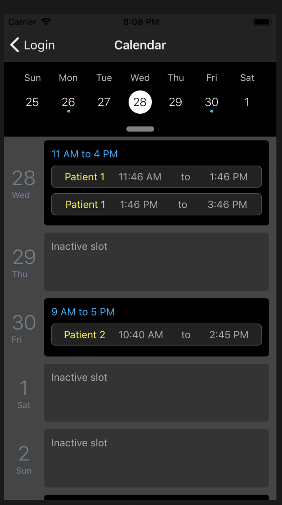

# DemoSchedule
This project demonstrates the UI of Calendar scheduling and slot allotment feature.

## Steps to run
1. Clone the project
2. Run `npm install` in the root folder
3. For iOS run `cd ios pod install`
4. Run the project on Android or iOS

